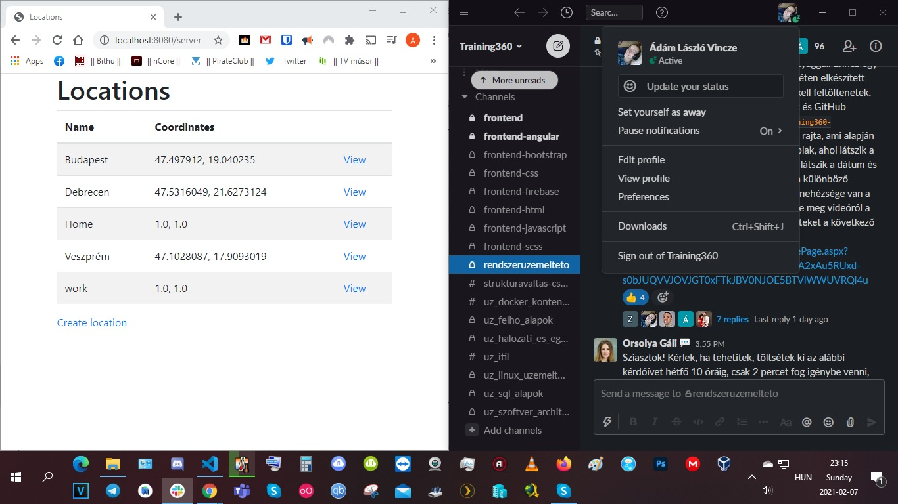

# training360-szoftverarchitekturak

# Location hozzáadás CLI-ból kézzel és CLI-ból script-tel (Standalone CLI gyakorlat)

# Standalone GUI gyakorlat

# Központi Adatbázis gyakorlat

# SQL gyakorlat

# NOSQL gyakorlat

# Többrétegű alkalmazások gyakorlat

# Webes alkalmazások gyakorlat

# Web formátumai: HTML és CSS gyakorlat

# Webes alkalmazas RIA felülettel - JavaScript gyakorlat

# Webes alkalmazas RIA felülettel - webes alkalmazás gyakorlat

# REST webszolgáltatások - Swagger gyakorlat

# REST webszolgáltatások - Postman gyakorlat

# Szerver alkalmazas webszolgáltatás interfesszel gyakorlat

# Magas rendelkezésre állás és skálázhatóság gyakorlat

# Virtualizació gyakorlat

